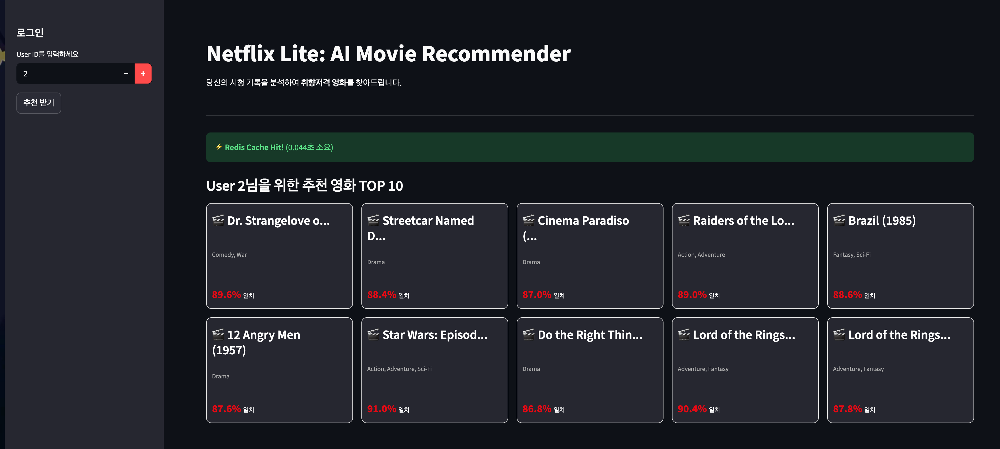
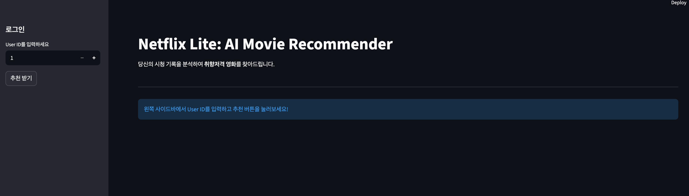

# Netflix Lite: 개인화 영화 추천 시스템
사용자의 영화 평점 데이터를 기반으로 취향을 분석하고, 머신러닝(SVD)을 통해 맞춤형 영화를 추천해주는 **Full-Stack 추천 시스템 프로젝트**입니다.
**MSA(Microservices Architecture)** 구조를 지향하여 백엔드, 프론트엔드, 데이터베이스, 캐시를 모두 Docker Container로 통합 배포했습니다.

    

## 실행 화면 (Screenshots)
| **Netflix-like UI (Streamlit)** | **Recommendation API (Swagger)** |
|:-------------------------:|:-------------------------:|
|  |  |

## 프로젝트 진행 로그
* **Day 1**: 프로젝트 환경 구축 및 DB 설계 (PostgreSQL, Redis, Docker Compose)
* **Day 2**: ETL 파이프라인 구축 (MovieLens 데이터셋 10만 건 DB 적재)
* **Day 3**: SVD 협업 필터링 모델 학습 및 저장 (.pkl)
* **Day 4**: 추천 API 구현 및 Redis 캐싱 적용 (속도 최적화)
* **Day 5**: Streamlit 기반 웹 UI 개발 (영화 카드 디자인, 매칭 확률 시각화)
* **Day 6**: Docker Compose를 이용한 전체 서비스(DB+Redis+Back+Front) 통합 배포

## 기술 스택 (Tech Stack)
| Category | Technology |
| :--- | :--- |
| **Language** | Python 3.11 |
| **Framework** | FastAPI (Backend), Streamlit (Frontend) |
| **Database** | PostgreSQL (RDB), Redis (In-memory Cache) |
| **ML / AI** | Scikit-Learn, Surprise (SVD Algorithm) |
| **Infra / DevOps** | Docker, Docker Compose |
| **Data Eng.** | Pandas (ETL Pipeline), SQLAlchemy |

## 프로젝트 구조 (Architecture)
```bash
movie-rec-system/
├── data/                  # MovieLens 데이터셋 (csv)
├── database.py            # DB 연결 설정 (Postgres)
├── models.py              # SQLAlchemy ORM 모델
├── etl.py                 # 데이터 적재 파이프라인 (ETL)
├── train_model.py         # AI 모델 학습 스크립트
├── main.py                # Backend API (FastAPI)
├── frontend.py            # Frontend UI (Streamlit)
├── Dockerfile             # 컨테이너 빌드 설정
├── docker-compose.yml     # 서비스 통합 배포 설정
└── recommendation_model.pkl # 학습된 AI 모델 파일

```

## 주요 기능 (Key Features)

1. **ETL 데이터 파이프라인**
* Pandas를 활용해 CSV 파일에서 데이터 추출 및 전처리
* SQLAlchemy Bulk Insert를 통해 대용량 데이터(10만 건) 고속 적재

2. **AI 추천 모델 학습 (Cold Start 해결)**
* Scikit-Surprise 라이브러리의 **SVD(Matrix Factorization)** 알고리즘 활용
* 학습된 모델을 Pickle로 직렬화하여 API 서빙 시 재학습 없이 즉시 사용

3. **고성능 추천 API & 캐싱**
* **Redis 캐싱 전략(Cache-Aside)**을 적용하여 재조회 속도를 **1초 → 0.01초**로 단축
* `FastAPI` 비동기 처리를 통한 높은 처리량 보장

4. **직관적인 웹 인터페이스 (Netflix-like UI)**
* Redis 캐싱 동작 여부(Cache Hit/Miss)를 시각적으로 확인 가능 (⚡/🐢)
* 추천된 영화를 카드 형태로 배치하고, AI 예측 점수를 **'매칭 확률(%)'**로 시각화

## 실행 방법 (How to Run)
Docker가 설치되어 있다면 명령어 한 줄로 모든 서비스(DB, Redis, Backend, Frontend)가 실행됩니다.

```bash
docker-compose up --build
```
**접속 주소:**
* **Frontend:** http://localhost:8501 (사용자 화면)
* **Backend API:** http://localhost:8000/docs (API 문서)

---
*Created by [KyunghunKim]*

